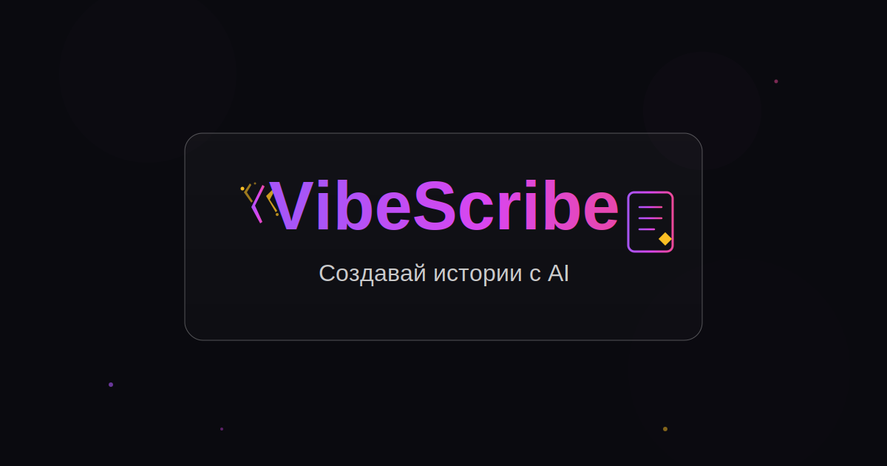

# 🖋️ VibeScribe — AI-Powered Story Creation Platform

Create characters, generate immersive stories with AI, narrate them with Text-to-Speech, and export as PDF.



## ✨ Features

- **AI Story Generation** — powered by Claude (Anthropic), with streaming output
- **Genre & Trope System** — Fantasy, Cyberpunk, Dark Romance, Romantasy, Thriller, and more
- **Character Creator** — build characters with appearance, traits, backstory; use them in stories
- **Story Continuation** — generate the next chapter of any story
- **Text-to-Speech** — built-in audio player with voice selection, speed/pitch controls, presets
- **PDF Export** — beautiful PDF output via Puppeteer (serverless Chromium)
- **Ink Economy** — currency system (🖋️ Inks) for story generation and exports
- **Referral System** — invite friends, both get 20 Inks
- **Password Reset** — email-based recovery via Resend or SendGrid
- **Dark Theme** — sleek dark UI with glassmorphism and gradient accents

## 🛠️ Tech Stack

- **Framework:** Next.js 14 (App Router)
- **Database:** PostgreSQL + Prisma ORM
- **Auth:** NextAuth.js (Credentials + Google OAuth)
- **AI:** Anthropic Claude API (streaming)
- **PDF:** Puppeteer + @sparticuz/chromium (serverless)
- **Email:** Resend or SendGrid
- **UI:** Tailwind CSS, Framer Motion, Radix UI, Lucide Icons

## 🚀 Quick Start

### 1. Clone & Install

```bash
git clone https://github.com/YOUR_USERNAME/vibescribe.git
cd vibescribe
npm install
```

### 2. Configure Environment

```bash
cp .env.example .env
```

Edit `.env` with your values:

| Variable | Required | Description |
|---|---|---|
| `DATABASE_URL` | ✅ | PostgreSQL connection string |
| `NEXTAUTH_SECRET` | ✅ | Random string for session encryption |
| `NEXTAUTH_URL` | ✅ | Your app URL (e.g. `http://localhost:3000`) |
| `ANTHROPIC_API_KEY` | ✅ | Anthropic API key ([console.anthropic.com](https://console.anthropic.com)) |
| `LLM_MODEL` | ❌ | Model name (default: `claude-sonnet-4-20250514`) |
| `GOOGLE_CLIENT_ID` | ❌ | For Google OAuth login |
| `GOOGLE_CLIENT_SECRET` | ❌ | For Google OAuth login |
| `RESEND_API_KEY` | ❌ | For password reset emails ([resend.com](https://resend.com)) |
| `SENDGRID_API_KEY` | ❌ | Alternative email provider |
| `EMAIL_FROM` | ❌ | Sender address for emails |

### 3. Set Up Database

```bash
npx prisma db push
npx prisma db seed
```

### 4. Run Locally

```bash
npm run dev
```

Open [http://localhost:3000](http://localhost:3000)

**Test account:** `john@doe.com` / `password123`

## ☁️ Deploy to Vercel

### One-Click Deploy

1. Push this repo to GitHub
2. Go to [vercel.com/new](https://vercel.com/new)
3. Import your GitHub repository
4. Add all environment variables from `.env.example`
5. Deploy!

### Important Vercel Settings

- **Framework Preset:** Next.js
- **Node.js Version:** 18.x or 20.x
- **Build Command:** `prisma generate && next build`
- **Function Max Duration:** Set to 30s for PDF export

### Database Options

- **[Neon](https://neon.tech)** — free PostgreSQL, serverless
- **[Supabase](https://supabase.com)** — free PostgreSQL with extras
- **[Railway](https://railway.app)** — easy PostgreSQL hosting
- **[Vercel Postgres](https://vercel.com/storage/postgres)** — native integration

## 📁 Project Structure

```
├── app/
│   ├── _components/          # Dashboard & Landing pages
│   ├── api/
│   │   ├── auth/              # NextAuth routes
│   │   ├── characters/        # Character CRUD
│   │   ├── demo/              # Demo story generation
│   │   ├── export/pdf/        # PDF export
│   │   ├── forgot-password/   # Password reset request
│   │   ├── generate/          # AI story generation (streaming)
│   │   ├── referral/          # Referral system
│   │   ├── reset-password/    # Password reset confirm
│   │   ├── signup/            # User registration
│   │   ├── stories/           # Story CRUD
│   │   └── user/balance/      # User balance & profile
│   ├── characters/            # Characters page
│   ├── login/                 # Login/Signup page
│   ├── reset-password/        # Password reset page
│   ├── studio/                # Story Studio page
│   └── subscribe/             # Subscription tiers page
├── components/
│   ├── audio-player.tsx       # TTS player
│   ├── header.tsx             # App header with nav
│   ├── prompt-cards.tsx       # Quick prompt ideas
│   ├── story-card.tsx         # Story list item
│   ├── story-modal.tsx        # Full story reader
│   ├── layouts/               # Layout components
│   └── ui/                    # Radix/shadcn components
├── lib/
│   ├── auth.ts                # NextAuth config
│   ├── db.ts                  # Prisma client
│   ├── types.ts               # Types & constants
│   └── utils.ts               # Utilities
├── prisma/
│   └── schema.prisma          # Database schema
└── scripts/
    └── seed.ts                # Database seeder
```

## 💰 Ink Costs

| Action | Cost |
|---|---|
| Flash Fiction (short) | 5 🖋️ |
| Standard Chapter | 10 🖋️ |
| Epic Chapter (long) | 20 🖋️ |
| Series Chapter | 15 🖋️ |
| Continue Story | 3 🖋️ |
| PDF Export | 2 🖋️ |

New users receive **50 🖋️** as a welcome bonus.

## 📄 License

MIT
